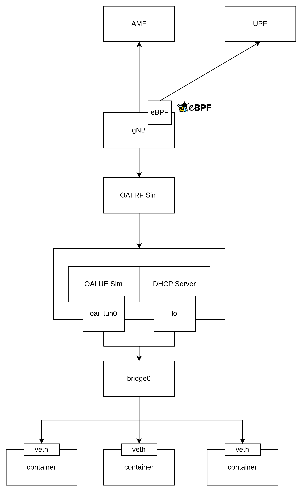
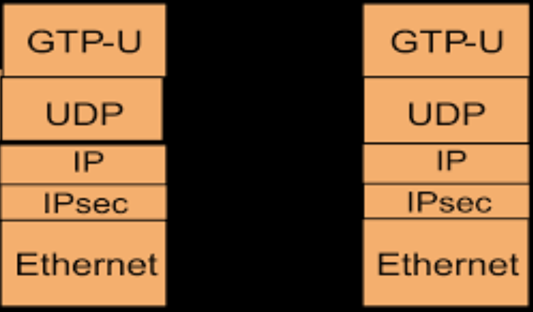
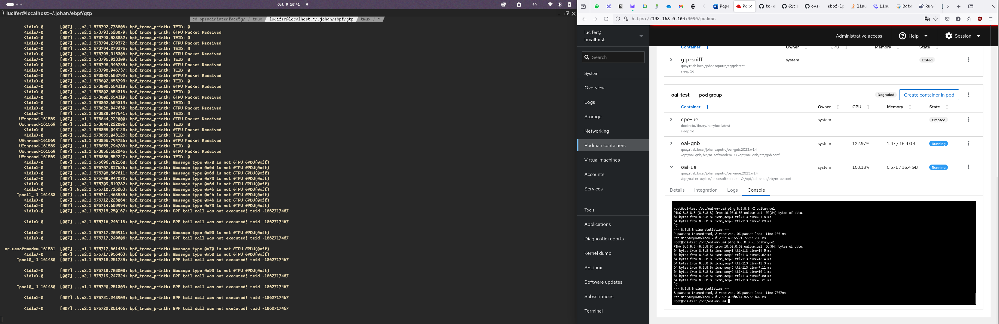

## What is GTP?
As wikipedia explanation, GPRS Tunnelling Protocol (GTP) is a group of IP-based communications protocols used to carry general packet radio service (GPRS) within GSM, UMTS, LTE and 5G NR radio networks. In 3GPP architectures, GTP and Proxy Mobile IPv6 based interfaces are specified on various interface points. GTP is a tunneling protocol is used for telecom technology for user plane, it means the users will access the Data Network (DN) using GTP Tunnel. This protocol similiar to VPN that create tunnel for each users, same with GTP, each user that already pass the registration by control plane will have user plane that allocate tunnel using GTP protocol.


## GTP Packet Filtering with eBPF
We will continue the progress from previous documentation of eBPF Trace SCTP Socket. We will continue to filter the GTP Protocol. Here is the architecture I used to setup the development and testing.



## Sniff GTP Packet

```c
#include <linux/bpf.h>
#include <linux/if_ether.h>
#include <linux/ip.h>
#include <linux/udp.h>
#include <linux/gtp.h>
#include <linux/in.h>
#include <bpf/bpf_helpers.h>

#define GTP_PORT 2152

SEC("xdp_gtp_sniff")
int xdp_gtp_sniff(struct xdp_md *ctx) {
    // Pointers for accessing packet data
    void *data = (void *)(long)ctx->data;
    void *data_end = (void *)(long)ctx->data_end;

    // Ethernet header
    struct ethhdr *eth = data;
    if ((void *)(eth + 1) > data_end) return XDP_PASS;

    // Check if the packet is an IPv4 packet
    if (eth->h_proto != __constant_htons(ETH_P_IP)) return XDP_PASS;

    // IP header
    struct iphdr *ip = (struct iphdr *)(eth + 1);
    if ((void *)(ip + 1) > data_end) return XDP_PASS;

    // Check if it's a UDP packet
    if (ip->protocol != IPPROTO_UDP) return XDP_PASS;

    // UDP header
    struct udphdr *udp = (struct udphdr *)((void *)ip + ip->ihl * 4);
    if ((void *)(udp + 1) > data_end) return XDP_PASS;

    // Check if the destination port is GTP-U (2152)
    if (udp->dest != __constant_htons(GTP_PORT)) return XDP_PASS;

    // GTP header
    struct gtpuhdr *gtp = (struct gtpuhdr *)(udp + 1);
    if ((void *)(gtp + 1) > data_end) return XDP_PASS;

    // Verify that this is a valid GTP-U packet
    if (gtp->flags != 0x30 || gtp->message_type != 0xff) return XDP_PASS;

    // Here you can add logic to process the GTP packet

    // Example: Dropping the packet
    return XDP_DROP; // Drop the packet after sniffing

    // Otherwise, allow the packet to pass through
    return XDP_PASS;
}

char _license[] SEC("license") = "GPL";

```

## UDP Trace from GTP

GTP-U is basically based on UDP packet. So to sniff packet of GTP, first and the foremost we need to parse UDP packet and decapsulate the GTP header to process the packet.



```c
#include <linux/bpf.h>
#include <linux/if_ether.h>
#include <linux/ip.h>
#include <linux/udp.h>
#include <linux/gtp.h>
#include <linux/in.h>
#include <stddef.h>
#include <linux/tcp.h>
#include <bpf/bpf_endian.h>
#include <bpf/bpf_helpers.h>

#define GTP_PORT 2152

// GTP-U header definition (simplified)
struct gtpuhdr {
    __u8 flags;
    __u8 message_type;
    __u16 length;
    __u32 tid;  // Tunnel Endpoint Identifier (TEID)
};

SEC("xdp_gtp")
int xdp_gtp_sniff(struct xdp_md *ctx) {
    // Pointers for accessing packet data
    void *data = (void *)(long)ctx->data;
    void *data_end = (void *)(long)ctx->data_end;

    // Ethernet header
    struct ethhdr *eth = data;
    if ((void *)(eth + 1) > data_end) return XDP_PASS;

    // Check if the packet is an IPv4 packet
    if (eth->h_proto != __constant_htons(ETH_P_IP)) return XDP_PASS;

    // IP header
    struct iphdr *ip = (struct iphdr *)(eth + 1);
    if ((void *)(ip + 1) > data_end) return XDP_PASS;

    // Check if it's a UDP packet
    if (ip->protocol != IPPROTO_UDP) return XDP_PASS;

	struct udphdr *udpdata = (void *)ip + sizeof(*ip);
	if ((void *)udpdata + sizeof(*udpdata) > data_end) return XDP_PASS;

	if (udpdata->dest != __constant_htons(GTP_PORT)) return XDP_PASS;

    __be32 dst_ip = udpdata->dest;
	unsigned char *dst = (unsigned char *)&dst_ip;

    static const char fmt[] = "DST: %lld . ";

	for (int i = 0; i < sizeof(dst) / sizeof(dst[0]); i++) {
		bpf_trace_printk(fmt, sizeof(fmt), dst[i]);
	}

    return XDP_PASS;
}

char _license[] SEC("license") = "GPL";

```



## GTP-U [IP UE and IP Destination]

In this scenario I have successfully sniff GTP-U packet from CU. As we can see as below, that eBPF already sniff UE IP and Destination IP, in example UE want to send ICMP packet(ping) to 8.8.8.8 IP.

