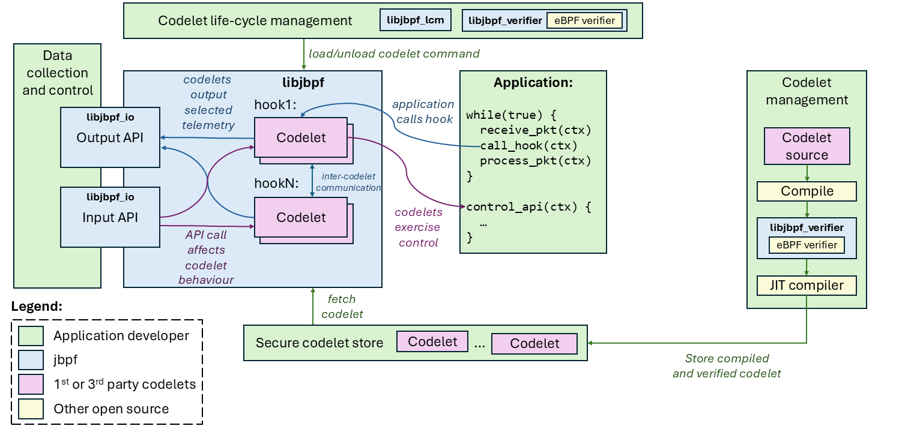

# What is jBPF?
jBPF stands for Janus BPF, an eBPF like program as part of janus project provided by microsoft. jBPF runs in user space mode unlike eBPF that runs in kernel stack, it is based on userspace BPF (uBPF). just like the developer said:

>Userspace eBPF instrumentation and control framework for deploying control and monitoring functions in a secure manner. It is part of Project Janus and provides probes for eBPF-like functionality outside of the Linux kernel.

As Telecom technology require low latency in such manner, eBPF comes for accomplish this requirement. eBPF already implemented in several usecases that require low latency and take control or modify metadata without interupt the process. In this telecom scenario also require this manner, and eBPF already proven to resolve this requirements, such as linux scheduler modification without interupt the entire process or kernel.

jBPF that part of janus project provided by microsoft already gives us the way to use eBPF instrumentation for Radio Access Network monitor and control utilization. The project you can find at here:
https://github.com/microsoft/jbpf.git

The jbpf instrumentation and control library provides a flexible and safe user-mode instrumentation framework built on eBPF technology. It splits responsibilities between the core application developers and a potentially broader community of developers who want safe access to instrumentation and control, similar to eBPF in Linux kernel. However, jbpf operates entirely in user mode and makes no calls to Linux kernel.

The core application developers define common instrumentation points with access to important internal application structures and APIs, but without prescribing how these will be consumed. Other developers can deploy their own code, inlined, at the instrumentation points. It allows them to efficiently process internal application data in an arbitrary way to extract particular information without needing to copy it elsewhere. The instrumentation code is statically verified before executed to enforce safety.

## jBPF Architecture
jBPF literaly same with BPF workflow, there are metadatas that we can receive and also can be modify by the bpf prog. If you're familiar with eBPF or uBPF, that eBPF code will be compiled into bpf object file and could be load using bpftool or something else. In jBPF we don't use bppftool to load the program, and the bpf object will called codelet in jBPF.



These are the basic terms used in the project:
* **Hook**: An instrumentation point at which we call user-provided code (see here for more on hooks).
* **Codelet**: A piece of user-provided code that gets executed once a hook point is called in the application (see here for mo**re * on codelets).
* **Codelet set**: A set of codelets that share maps or other things and have to be deployed together.
* **Map**: A shared memory location that is accessible to one or more codelets, typically used to store data between in** vocaions, * share across codelets, or communicate with the rest of the system (see here for more on maps).
* **Helper function**: A function implemented by the application and exposed to the codelet, typically used to affect the application behaviour or perform complex operations that are hard to verify (see here for more on helper functions).

## srsRAN integration
There is project for srsran integration with jbpf, you can go to jbpf repository and find the repo at there. Otherwise, I just create my integration by my self with reference by that repo. In my integration, I focuse on retrieve CU_CP telemetry, such as du_index, plmn and ue_index.

1. Modify the gnb.cpp

  We need to include jbpf headers file and our custom headers. Also we need to initialize the jbpf process. And the important part is you need to register the jbpf thread to srsran thread process, because jbpf is running inside it's own thread.

  ```c
    #include "srsran/jbpf/inc/jbpf.h"
    #include "srsran/jbpf/inc/jbpf_hook.h"
    #include "srsran/jbpf/inc/jbpf_defs.h"
    #include "srsran/jbpf/jbpf_context.h"
    #include "srsran/jbpf/common.h"
    #include "srsran/jbpf/jbpf_srsran_hooks.h"
    #include "srsran/jbpf/inc/jbpf.h"


    #define IPC_NAME "example_ipc_app"

    jbpf_io_stream_id_t control_input_stream_id = {
        .id = {0x11, 0x11, 0x11, 0x11, 0x11, 0x11, 0x11, 0x11, 0x11, 0x11, 0x11, 0x11, 0x11,    0x11, 0x11, 0x11}};

    jbpf_io_stream_id_t output_data_stream_id = {
        .id = {0x00, 0x11, 0x22, 0x33, 0x44, 0x55, 0x66, 0x77, 0x88, 0x99, 0xAA, 0xBB, 0xCC,    0xDD, 0xEE, 0xFF}};

    // Used to covert data of type Packet to JSON format
    boost::property_tree::ptree
    toPtree(const jbpf_cucp_uemgr_ctx_info& packet)
    {
        boost::property_tree::ptree pt;
        pt.put("ctx_id", packet.ctx_id);
        pt.put("du_index", packet.du_index);
        pt.put("plmn", packet.plmn);
        pt.put("ue_index", packet.ue_index);
        return pt;
    }

    std::string
    toJson(const boost::property_tree::ptree& pt)
    {
        std::ostringstream oss;
        boost::property_tree::write_json(oss, pt);
        return oss.str();
    };

    static void
    io_channel_print_output(jbpf_io_stream_id_t* stream_id, void** bufs, int num_bufs, void*    ctx)
    {
        if (stream_id && num_bufs > 0) {

        // Check that the data corresponds to a known output channel
        if (memcmp(&output_data_stream_id, stream_id, sizeof(jbpf_io_stream_id_t)) != 0)    {
                std::cout << "ERROR: Unknown stream_id" << std::endl;
                return;
        }

        // Fetch the data and print in JSON format
        for (auto i = 0; i < num_bufs; i++) {

            jbpf_cucp_uemgr_ctx_info p = *static_cast<jbpf_cucp_uemgr_ctx_info*>(bufs[i])   ;

            boost::property_tree::ptree pt = toPtree(p);
            std::string json = toJson(pt);

            std::cout << json << std::endl;

            // Send an acknowledgement message back to the codelet
            PacketResp resp = {1};
            jbpf_send_input_msg(&control_input_stream_id, &resp, sizeof(resp));
        }
        }
    }
    .
    .
    .
    // ======== START JBPF ========= //
      struct jbpf_config jbpf_config = {0};
      jbpf_set_default_config_options(&jbpf_config);

      // Enable LCM IPC interface using UNIX socket at the default socket path (the default is through C API)
      jbpf_config.lcm_ipc_config.has_lcm_ipc_thread = true;
      snprintf(
          jbpf_config.lcm_ipc_config.lcm_ipc_name,
          sizeof(jbpf_config.lcm_ipc_config.lcm_ipc_name) - 1,
          "%s",
          JBPF_DEFAULT_LCM_SOCKET);

      // Initialize jbpf
      if (jbpf_init(&jbpf_config) < 0) {
          exit(-1);
      }

      // Any thread that calls a hook must be registered
      jbpf_register_thread();
      jbpf_register_io_output_cb(io_channel_print_output);
    // ======== END JBPF ========= //

  ```

2. Write custom hook macro

  As the documentation guide, to working with jBPF we need hook point. A hook function is a process to tell the codelet which process will be used by the codelet.

  ```c
    /* CUCP UE Manager */

    DECLARE_JBPF_HOOK(cucp_uemgr_ue_add,
        struct jbpf_ran_generic_ctx ctx,
        ctx,
        HOOK_PROTO(
            jbpf_cucp_uemgr_ctx_info *info,
            bool pci_set,
            uint16_t pci,
            bool rnti_set,
            uint16_t rnti),
        HOOK_ASSIGN(
            ctx.data = (uint64_t)info;
            ctx.data_end = (uint64_t) ((uint8_t*)info + sizeof(struct   jbpf_cucp_uemgr_ctx_info));
            ctx.srs_meta_data1 = ((uint64_t)pci_set) << 16 | pci;
            ctx.srs_meta_data2 = (uint64_t)rnti_set << 16 | rnti;
        )
    )
  ```

3. modify the file

  then because in this docs, I will retrive data from cu_cp, I need to modify ue_manager_impl.cpp. You can modify anywhere, depends on what data we want to retrieve.

  ```c
    DEFINE_JBPF_HOOK(cucp_uemgr_ue_add);
    .
    .
    .
    .
    struct jbpf_cucp_uemgr_ctx_info ctx_info = {0, (uint16_t)du_index, plmn.to_bcd(),   (uint64_t)new_ue_index};
    hook_cucp_uemgr_ue_add(&ctx_info, pci.has_value(), pci.value(), rnti.has_value(), to_value(rnti.value()));
  ```

4. Create Codelet

  As I mentioned before, codelet is bascially eBPF prog.

  ```c
#include <string.h>
#include "jbpf_defs.h"
#include "jbpf_helper.h"
#include "common.h"

jbpf_ringbuf_map(outmap, struct jbpf_cucp_uemgr_ctx_info, 100);
jbpf_control_input_map(inmap, struct PacketResp, 100);

// A map of type JBPF_MAP_TYPE_ARRAY, which is used
// to store internal codelet state.
struct jbpf_load_map_def SEC("maps") counter = {
    .type = JBPF_MAP_TYPE_ARRAY,
    .key_size = sizeof(int),
    .value_size = sizeof(int),
    .max_entries = 4,
};

SEC("jbpf_generic")
uint64_t
jbpf_main(void* state)
{
    struct jbpf_ran_generic_ctx* ctx;
    ctx = (struct jbpf_ran_generic_ctx*)state;

    struct jbpf_cucp_uemgr_ctx_info *p, *p_end;
    struct jbpf_cucp_uemgr_ctx_info echo;
    struct PacketResp resp = {0};

	jbpf_printf_debug(">>> UE ADD called: ctx_id=%u, d_index=%lu, plmn=%u\n", echo.ctx_id, echo.du_index, echo.plmn);
	void* c;
    int cnt;
    uint64_t index = 0;
	c = jbpf_map_lookup_elem(&counter, &index);
    if (!c)
        return 1;

    cnt = *(int*)c;
    cnt++;
    *(uint32_t*)c = cnt;

	p = (void*)ctx->data;
    p_end = (void*)ctx->data_end;
	if (p + 1 > p_end)
        return 1;

	echo = *p;
	if (jbpf_ringbuf_output(&outmap, &echo, sizeof(echo)) < 0) {
        return 1;
    }

	while(jbpf_control_input_receive(&inmap, &echo, sizeof(echo)) > 0) {
		echo.du_index = 1;
		jbpf_printf_debug("Got aggregate value %u\nh", echo.du_index);
	}
    return 0a;
}
  ```

## Run the program

If the code modification already done, we can compile it and run it. First run the srsRAN gnb, try to load the codelet and finally, try to start UE and see what's happen. If it shows the parameters we set, it indicates we successfully create our first RIC using jBPF.

the output should be like this.

```shell
  ==== gNB started ===
  Type <h> to view help
  2025-04-24T06:54:21.825696Z [JBPF][IO][DEBUG]: Received 79640 bytes
  2025-04-24T06:54:21.844989Z [JBPF][CORE][DEBUG]: Creating codelet   cucp_uemgr_ue_add_codelet
  2025-04-24T06:54:21.845051Z [JBPF][CORE][DEBUG]: Registering helper function  jbpf_map_lookup
  2025-04-24T06:54:21.845057Z [JBPF][CORE][DEBUG]: Registering helper function  jbpf_map_lookup_reset
  2025-04-24T06:54:21.845060Z [JBPF][CORE][DEBUG]: Registering helper function  jbpf_map_update
  2025-04-24T06:54:21.845065Z [JBPF][CORE][DEBUG]: Registering helper function  jbpf_map_delete
  2025-04-24T06:54:21.845069Z [JBPF][CORE][DEBUG]: Registering helper function  jbpf_map_clear
  2025-04-24T06:54:21.845073Z [JBPF][CORE][DEBUG]: Registering helper function  jbpf_map_dump
  2025-04-24T06:54:21.845077Z [JBPF][CORE][DEBUG]: Registering helper function  jbpf_time_get_ns
  2025-04-24T06:54:21.845082Z [JBPF][CORE][DEBUG]: Registering helper function  jbpf_get_sys_time
  2025-04-24T06:54:21.845086Z [JBPF][CORE][DEBUG]: Registering helper function  jbpf_get_sys_time_diff_ns
  2025-04-24T06:54:21.845091Z [JBPF][CORE][DEBUG]: Registering helper function jbpf_hash
  2025-04-24T06:54:21.845094Z [JBPF][CORE][DEBUG]: Registering helper function jbpf_printf
  2025-04-24T06:54:21.845098Z [JBPF][CORE][DEBUG]: Registering helper function  jbpf_ringbuf_output
  2025-04-24T06:54:21.845102Z [JBPF][CORE][DEBUG]: Registering helper function  jbpf_mark_runtime_init
  2025-04-24T06:54:21.845107Z [JBPF][CORE][DEBUG]: Registering helper function  jbpf_runtime_limit_exceeded
  2025-04-24T06:54:21.845110Z [JBPF][CORE][DEBUG]: Registering helper function jbpf_rand
  2025-04-24T06:54:21.845113Z [JBPF][CORE][DEBUG]: Registering helper function  jbpf_control_input_receive
  2025-04-24T06:54:21.845117Z [JBPF][CORE][DEBUG]: Registering helper function  jbpf_get_output_buf
  2025-04-24T06:54:21.845121Z [JBPF][CORE][DEBUG]: Registering helper function  jbpf_send_output
  2025-04-24T06:54:21.845746Z [JBPF][CORE][DEBUG]: Map counter registered successfully for  codelet cucp_uemgr_ue_add_codelet
  2025-04-24T06:54:21.845765Z [JBPF][CORE][INFO]: Registered map counter to codelet   cucp_uemgr_ue_add_codelet
  2025-04-24T06:54:21.847736Z [JBPF][IO][INFO]: Creating channel  00112233445566778899aabbccddeeff
  2025-04-24T06:54:21.847781Z [JBPF][MEM_MGMT][INFO]: Added 63 elements to the ringbuf
  2025-04-24T06:54:21.847786Z [JBPF][MEM_MGMT][INFO]: The size of the mempool is 63 and   the capacity is 63
  2025-04-24T06:54:21.847795Z [JBPF][CORE][DEBUG]: Map outmap registered successfully for   codelet cucp_uemgr_ue_add_codelet
  2025-04-24T06:54:21.847802Z [JBPF][CORE][INFO]: Registered map outmap to codelet  cucp_uemgr_ue_add_codelet
  2025-04-24T06:54:21.847808Z [JBPF][IO][INFO]: Creating channel  11111111111111111111111111111111
  2025-04-24T06:54:21.847827Z [JBPF][MEM_MGMT][INFO]: Added 63 elements to the ringbuf
  2025-04-24T06:54:21.847831Z [JBPF][MEM_MGMT][INFO]: The size of the mempool is 63 and   the capacity is 63
  2025-04-24T06:54:21.847837Z [JBPF][CORE][DEBUG]: Map inmap registered successfully for  codelet cucp_uemgr_ue_add_codelet
  2025-04-24T06:54:21.847840Z [JBPF][CORE][INFO]: Registered map inmap to codelet   cucp_uemgr_ue_add_codelet
  2025-04-24T06:54:21.847844Z [JBPF][CORE][DEBUG]: Map inmap is already registered!
  2025-04-24T06:54:21.848432Z [JBPF][CORE][DEBUG]: Created codelet  cucp_uemgr_ue_add_codelet
  2025-04-24T06:54:21.848442Z [JBPF][CORE][INFO]: Registered codelet  cucp_uemgr_ue_add_codelet to hook cucp_uemgr_ue_add
  2025-04-24T06:54:21.848446Z [JBPF][CORE][INFO]: ----------------- cucp_uemgr_ue_add:  cucp_uemgr_ue_add_codelet ----------------------
  2025-04-24T06:54:21.848450Z [JBPF][CORE][INFO]: hook_name = cucp_uemgr_ue_add, priority   = 1, runtime_threshold = 0
  2025-04-24T06:54:21.848454Z [JBPF][CORE][INFO]: Codelet created and loaded successfully:  cucp_uemgr_ue_add_codelet
  2025-04-24T06:54:21.848459Z [JBPF][CORE][DEBUG]: Codeletset is loaded OK 0
  2025-04-24T06:54:21.848470Z [JBPF][IO][DEBUG]: Sent 516 bytes
  2025-04-24T06:54:25.520540Z [JBPF][CORE][DEBUG]: >>> UE ADD called: ctx_id=0, d_index=0,  plmn=4
  {
      "ctx_id": "0",
      "du_index": "1",
      "plmn": "61712",
      "ue_index": "0"
  }

  2025-04-24T06:54:25.735163Z [JBPF][CORE][DEBUG]: >>> UE ADD called: ctx_id=0, d_index=0,  plmn=4
  2025-04-24T06:54:25.735179Z [JBPF][CORE][DEBUG]: Got aggregate value 0
  {
      "ctx_id": "0",
      "du_index": "1",
      "plmn": "61712",
      "ue_index": "1"
  }
```
